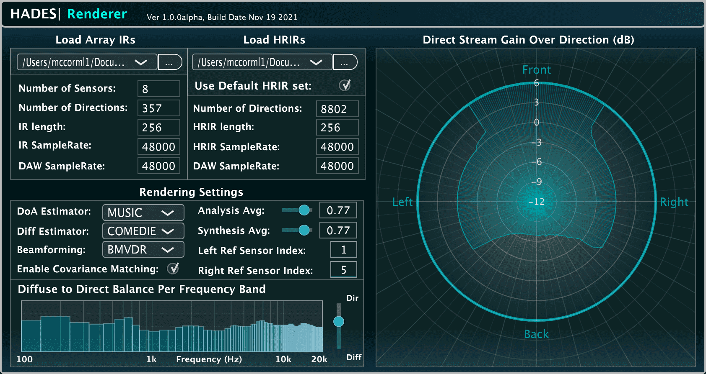

# HADES

Binaural rendering solutions for Hearing-Assistive/Augmented-reality Devices (HADES) is an open-source repository of both MATLAB and C implementations of the proposed and tested algorithms described in: 
*  Fernandez, J., McCormack, L., Hyvärinen, P., Politis, A., and Pulkki V. 2022. [**Enhancing binaural rendering of head-worn microphone arrays through the use of adaptive spatial covariance matching**](https://github.com/jananifernandez/HADES/blob/master/docs/fernandez2022enhancing.pdf), The Journal of the Acoustical Society of America 151(4), 2624-2635

## MATLAB code

The MATLAB code may be found in the [matlab](matlab) folder. 

## C code

The algorithms have also been implemented in C using the [Spatial_Audio_Framework](https://github.com/leomccormack/Spatial_Audio_Framework).

## VST audio plug-in

The C code has also been wrapped into a VST audio plug-in using the [JUCE](https://github.com/WeAreROLI/JUCE/) framework:



### Pre-built plug-in

The **hades_renderer.vst** plug-in is included in the SPARTA installer, which can be downloaded from [here](https://github.com/leomccormack/SPARTA/releases/latest).

### Building the plug-in yourself

First clone the repository (including submodules) with:

```
git clone --recursive https://github.com/jananifernandez/HADES
# or if you have already cloned the repository, update/init with:
git submodule update --init --recursive
```

### Prerequisites 

The [VST2_SDK](https://web.archive.org/web/20181016150224/https://download.steinberg.net/sdk_downloads/vstsdk3610_11_06_2018_build_37.zip) should be placed in the 'SDKs' folder like so:
```
SDKs/VST2_SDK
```

By default, **MacOSX, Linux and Windows (x86_64/amd64)** users need to install [Intel oneAPI](https://www.intel.com/content/www/us/en/developer/tools/oneapi/base-toolkit-download.html) (MKL and IPP) and run the **install-safmkl**.sh/.bat and **install-safipp**.sh/.bat scripts found in SDKs/Spatial_Audio_Framework/scripts. Whereas, **Raspberry Pi (ARM)** users instead require OpenBLAS and LAPACKE libraries:
``` 
sudo apt-get install liblapack3 liblapack-dev libopenblas-base libopenblas-dev liblapacke-dev
```
Note, however, that alternative performance libraries may also be used, with more information provided [here](https://github.com/leomccormack/Spatial_Audio_Framework/blob/master/docs/PERFORMANCE_LIBRARY_INSTRUCTIONS.md).

**Linux (x86_64/amd64 and ARM)** users must also install the following libraries required by JUCE:

```
sudo apt-get install x11proto-xinerama-dev libwebkit2gtk-4.0-dev libgtk-3-dev x11proto-xext-dev libcurl4-openssl-dev libasound2-dev
```

### Building the plug-in via CMake 

The plug-in may be built with CMake (version 3.15 or higher):
 ```
 mkdir build
 cmake -S . -B build -DSAF_ENABLE_SOFA_READER_MODULE=1 -DSAF_ENABLE_HADES_MODULE=1
 cd build
 make
 ```
 
Or for Visual Studio users (using x64 Native Tools Command Prompt as **administrator**):
```
cmake -S . -B build -G "Visual Studio 15 Win64" -DSAF_ENABLE_SOFA_READER_MODULE=1 -DSAF_ENABLE_HADES_MODULE=1
cd build
msbuild ALL_BUILD.vcxproj /p:Configuration=Release /m
```

## Contributors 

* **Janani Fernandez** - C/C++ programmer and algorithm design (contact: janani.fernandez(at)aalto.fi)
* **Leo McCormack** - C/C++ programmer and algorithm design (contact: leo.mccormack(at)aalto.fi)

## License

This project is provided under the GPLv3 License - see the [LICENSE](LICENSE) file for details. 
